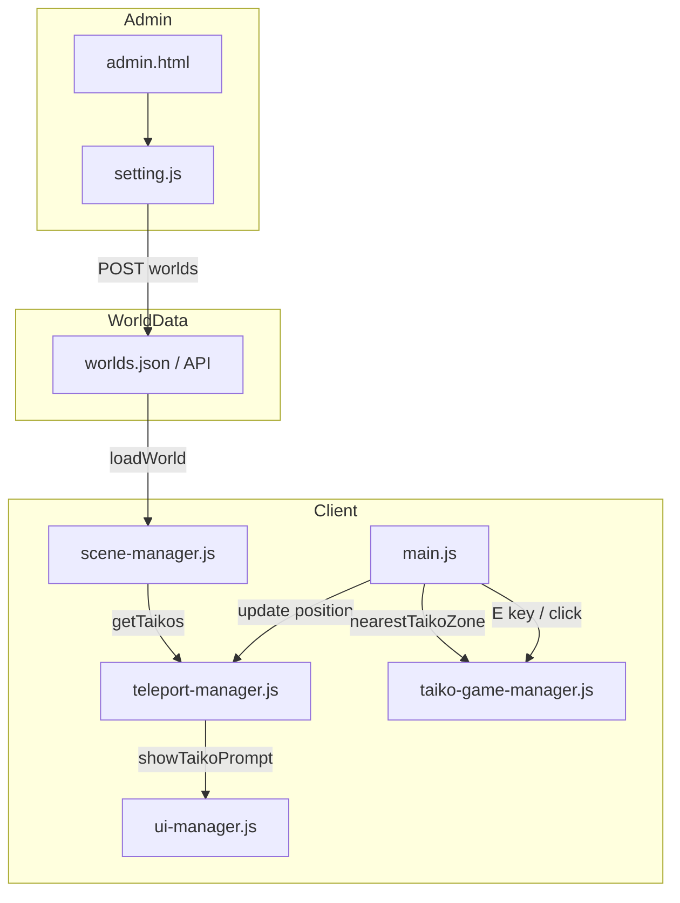

# 轟太鼓メタバース実装計画

## 1. Admin UI 変更

### 1.1 名称変更と太鼓トグル追加

**対象**: [public/admin.html](public/admin.html) 477-498行

- `object-props-animation` の `<summary>` を「アニメーション」→「モジュール設定」に変更
- 回転アニメーション設定の直下（`</div></details>` の前）、テレポーターの前に太鼓ブロックを追加:

```html
<details class="block" id="object-props-taiko">
    <summary class="block-header">太鼓</summary>
    <div class="block-content">
        <div class="prop-row checkbox-row">
            <input type="checkbox" id="obj-taiko" class="prop-checkbox">
            <label class="prop-label" for="obj-taiko">太鼓にする</label>
        </div>
        <div class="prop-row">
            <label class="prop-label" for="obj-taiko-radius">接近検知範囲</label>
            <input type="number" id="obj-taiko-radius" class="prop-input num" step="0.1" min="0" value="3">
            <span class="prop-unit">m</span>
        </div>
    </div>
</details>
```

### 1.2 setting.js の更新

**対象**: [public/js/setting.js](public/js/setting.js)

- `object-props-taiko` の表示制御（config あり・PDF以外のモデルのとき表示）
- `updateObjectPanel`: `c.taiko` を読み取り obj-taiko, obj-taiko-radius に反映
- `syncObjectFromPanel`: obj-taiko のチェック状態を `c.taiko` に保存
- `buildWorldsFromScene`: taiko プロパティを models に含める
- `loadWorldIntoScene`: taiko 設定を持つモデルを正しく復元
- `obj-taiko`, `obj-taiko-radius` の change イベント登録

**データ形式例**:

```json
"taiko": { "radius": 3 }
```

---

## 2. シーン管理・太鼓ゾーン登録

### 2.1 scene-manager.js

**対象**: [public/js/scene-manager.js](public/js/scene-manager.js)

- `this.taikos = []` を追加（teleporters と同様）
- `loadWorldModels` 内で `config.taiko` ありのモデルを `this.taikos` に登録
- `clearWorld` で `this.taikos = []` をクリア
- `getTaikos()` メソッド追加

### 2.2 world-manager.js

**対象**: [public/js/world-manager.js](public/js/world-manager.js)

- `loadWorld` 時、models に `taiko` が含まれることを確認（scene-manager が自動処理）

---

## 3. 接近検知とプロンプト

### 3.1 方針

既存のテレポート／PDF と同じ仕組みを拡張する:

- テレポーター: `TeleportManager` の zones
- PDF: `sceneManager.getNearbyPdfObject(position, 5)`
- 太鼓: 新規に「太鼓ゾーン」を追加し、最寄りのインタラクションを1つ選んでプロンプト表示

### 3.2 main.js の変更

**対象**: [public/js/main.js](public/js/main.js)

- `nearbyTaikoZone` を追加（`nearbyPdfPath` と同様）
- `onWorldChanged` で `updateTaikoZones()` を呼ぶ
- `updateTaikoZones()`: `sceneManager.getTaikos()` を取得し、TeleportManager に渡す（または別のインタラクション管理に統合）

### 3.3 TeleportManager の拡張

**対象**: [public/js/teleport-manager.js](public/js/teleport-manager.js)

- `taikoZones` を追加
- `addTaikoZone(zone)`, `clearTaikoZones()`, `getNearestTaikoZone(position)` を追加
- `update(position)`: テレポーターに加え、太鼓ゾーンも距離チェック。`nearestTaikoZone` を更新
- プロンプト表示の優先度: **太鼓 > PDF > テレポーター**（距離が同程度なら太鼓を優先）
- `handleTeleport` を `handleInteract` 的に拡張:
  1. `nearestTaikoZone` があれば → 太鼓ゲームを開く
  2. 次に `getPdfPath()` があれば → PDF ビューワー
  3. それ以外で `nearestZone` があれば → テレポート

### 3.4 UIManager

**対象**: [public/js/ui-manager.js](public/js/ui-manager.js)

- `showTaikoPrompt()` を追加: `this.teleportPrompt.textContent = '太鼓をたたく';`

### 3.5 main.js の animate ループ

**対象**: [public/js/main.js](public/js/main.js) 520-534行付近

プロンプト表示ロジックを修正:

```
if (pdfViewer open) -> hide
else if (nearestTaikoZone が PDF/teleporter より近い) -> showTaikoPrompt
else if (nearbyPdfPath) -> showPdfPrompt
else if (nearestZone) -> showTeleportPrompt
else -> hide
```

---

## 4. 太鼓ゲーム UI

### 4.1 HTML 構造

**対象**: [public/index.html](public/index.html)

PDF ビューワーオーバーレイの後に、太鼓ゲーム用オーバーレイを追加:

```html
<!-- 太鼓ゲームオーバーレイ -->
<div id="taiko-game-overlay" class="taiko-game-overlay" style="display: none;">
    <button type="button" id="taiko-game-close" class="taiko-game-close" title="閉じる">×</button>
    <div class="taiko-game-container">
        <div class="taiko-game-header">
            <div class="taiko-game-title">タイトル</div>
            <div class="taiko-game-bar">
                <div class="taiko-game-score">score: 0</div>
                <div class="taiko-game-lane">
                    <div class="taiko-game-judge-line"></div>
                    <div class="taiko-game-notes"></div>
                </div>
            </div>
        </div>
        <div class="taiko-game-input">
            <div class="taiko-input-ka">カツ</div>
            <div class="taiko-input-don">
                <span>ドン</span><span>ドン</span>
            </div>
            <div class="taiko-input-ka">カツ</div>
        </div>
    </div>
</div>
```

### 4.2 CSS

**対象**: [public/css/style.css](public/css/style.css)

画像のレイアウトに合わせたスタイル:

- オーバーレイ: 固定、全画面、背景半透明
- 上部: タイトルエリア、スコア＋ノーツレーン（右→左へ流れる）
- 下部: カツ | ドン(左) ドン(右) | カツ の入力エリア
- 判定ライン（垂直線）、ノーツ（円形）
- 既存の `.pdf-viewer-overlay` を参考に z-index 等を調整

### 4.3 taiko-game-manager.js（新規）

**責務**:

- オーバーレイの表示／非表示
- ノーツの生成・右→左への移動アニメーション
- 判定ライン通過時の判定（良／可／不可）
- キー入力: ドン（D/F または左右クリック）、カツ（J/K または別キー）
- スコア更新
- 閉じるボタン・Escape キーで閉じる

**初回実装 scope**:

- デモ用の固定譜面（数小節）で動作確認
- 楽曲は未使用、またはシンプルなビープ音のみ
- フルリズムゲームエンジンは後続で拡張可能な形に

---

## 5. データフロー概要




---

## 6. 実装順序

1. Admin: モジュール設定名変更、太鼓トグル・半径追加、setting.js 連携
2. scene-manager: taiko 追跡、getTaikos
3. TeleportManager: 太鼓ゾーン追加、update/handleInteract 拡張
4. UIManager: showTaikoPrompt
5. main.js: updateTaikoZones、animate 内プロンプト優先度、TaikoManager 初期化
6. index.html: 太鼓オーバーレイ HTML
7. style.css: 太鼓ゲーム用スタイル
8. taiko-game-manager.js: オーバーレイ制御、簡易ノーツ＋判定、スコア表示

---

## 7. 注意事項

- **用語**: 太鼓の達人に類似した表現（ドン／カツなど）を使用するが、UI・ロゴ・楽曲は完全にオリジナルとし、権利侵害を避ける
- **楽曲**: 初回は効果音のみ、または権利フリー音源に限定
- **モバイル**: タップでドン／カツ入力のサポートを検討（後続対応可）

