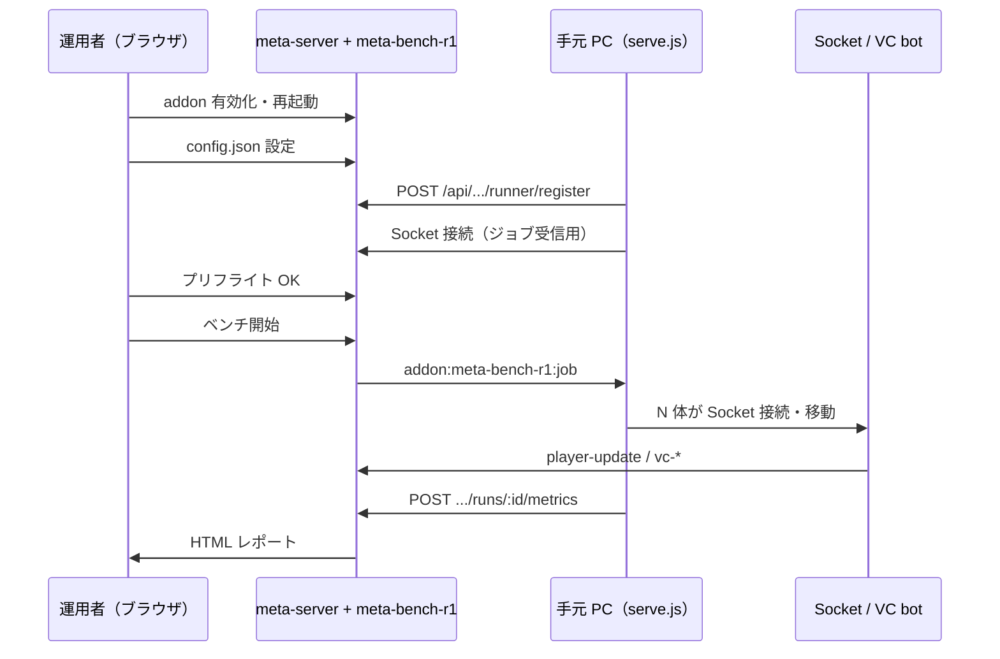

# meta-bench-r1 ベンチ実行ガイド（初めて動かす人向け）

meta-bench-r1 は **メタバース本番サーバー** と **手元 PC の Bench Runner** の 2 つで動きます。  
このドキュメントは「初回セットアップ → 実際に 1 回ベンチが回る」までを順番に説明します。

関連: [運用手順書（詳細）](meta-benchR1-runbook.md) / [実装計画](meta-benchR1-implementation-plan.md)

---

## 全体像



| 役割 | 何をするか |
|------|------------|
| **本番サーバー** | ベンチの開始/停止、メンテナンスモード、CPU/DB 計測、レポート生成 |
| **Bench Runner（手元 PC）** | 大量の bot を Socket で接続し、移動・ping・VC 負荷をかける |
| **管理画面** | プリフライト、ベンチ開始、Runner 状態確認、レポート閲覧 |

---

## 前提

- Node.js が本番サーバー・手元 PC の両方で動くこと
- 手元 PC から本番の URL（例: `https://metapre.mmh-virtual.jp`）に **HTTPS で到達**できること
- 本番で **mediasoup（ボイスチャット）** が起動していること（VC ベンチに必要）
- リポジトリを手元 PC に clone 済み、または `runner/serve.js` を実行できること

---

## ステップ 0: 初回だけ（サーバー側）

### 0-1. addon を有効化

1. ブラウザで `https://<your-host>/admin.html` を開く
2. 左メニュー **アドオン**
3. 一覧から **`meta-bench-r1`** を **有効** にする  
   （他 addon が有効のままでもベンチは実行できます）

### 0-2. Node を再起動

addon の有効/無効は **再起動後** に反映されます。  
詳細: [addons-restart-policy.md](addons-restart-policy.md)

再起動後、サーバーログに次が出れば OK です。

```
[addons] loaded meta-bench-r1@1.0.0
```

### 0-3. config.json を置く

**パス（サーバー上）:**

```
addons/meta-bench-r1/config.json
```

**作り方:**

```bash
cp addons/meta-bench-r1/config.json.example addons/meta-bench-r1/config.json
```

**最低限編集する項目:**

| キー | 内容 |
|------|------|
| `runnerSecret` | Runner とサーバーで共有する長いランダム文字列（本番では必ず変更） |

その他は `config.json.example` のコメントどおり。設定の優先順位:

1. `config.json`
2. 管理画面アドオンタブのキー/値
3. 環境変数 `ADDON_META_BENCH_R1_<KEY>`（例: `ADDON_META_BENCH_R1_RUNNERSECRET`）

`config.json` を変えたら **もう一度 Node 再起動**。

### 0-4. 管理画面に「ベンチR1」が出るか確認

左メニューに **ベンチR1** があること。  
クリックでパネルが開けば UI は OK（開かない場合は `public/js/admin.js` のデプロイ・ブラウザのハードリロードを確認）。

---

## ステップ 1: 毎回ベンチの前（Runner 起動）

ベンチは **Runner が接続されていないと開始できません**。

### 1-1. 手元 PC で Runner を起動

リポジトリルート（`metaverse-simple`）で:

```bash
node addons/meta-bench-r1/runner/serve.js \
  --server https://<your-host> \
  --secret <config.json の runnerSecret と同じ値> \
  --name my-laptop \
  --max-bots 50 \
  --debug
```

`--debug` を付けると接続失敗・ジョブ進行・各 bot の状態など詳細ログが出ます。トラブル時は必ず付けて起動してください。通常運用では省略可。

成功時のログ例:

```
[runner:main] 2026-07-03T09:00:00.000Z starting { server, name, maxBots, debug: true }
[runner:main] 2026-07-03T09:00:00.100Z registered { runner: ... }
[runner:socket] 2026-07-03T09:00:00.200Z connected { id: '<socket-id>', transport: 'websocket' }
[runner:socket] 2026-07-03T09:00:00.250Z runner-attach ok { ok: true }
```

接続失敗時は `[runner:error:...]` や `[runner:warn:...]` が出ます。例:

```
[runner:error:socket] connect_error AUTH_REQUIRED | data={"code":"..."}
[runner:debug:socket] connect_error detail { message, data, ... }
[runner:warn:socket-pool] bot 3 failed bot-3: connect timeout (15s)
```

`connect_error` が続く場合は **サーバー側のデプロイ**（`server.js` の runnerSecret 対応）が古い可能性があります。Node 再起動後に再試行してください。

**ペアリングコード方式**（`runnerSecret` を Runner 側に書きたくない場合）:

1. 管理画面 **ベンチR1** → **ペアリングコード発行**（6 桁・10 分有効）
2. `node addons/meta-bench-r1/runner/serve.js --server https://<your-host> --pairing 123456 --name my-laptop`

> ペアリングのみの Runner は heartbeat を送らないため、長時間放置すると P-01 で落ちることがあります。本番運用は `--secret` 推奨です。

### 1-2. 管理画面で Runner 状態を確認

**ベンチR1** パネル → **Runner 状態を更新**

- **接続中** と表示されれば OK
- **未接続** のときは Runner のターミナルログ・ファイアウォール・URL を確認（`--debug` 推奨）

---

## ステップ 2: プリフライト

管理画面 **ベンチR1** → **プリフライト** を押す。

全部 OK なら「プリフライト合格」。失敗した項目と対処:

| 表示 | 意味 | 対処 |
|------|------|------|
| Runner が未接続… | P-01 | ステップ 1 の `serve.js` を起動・URL/secret 確認 |
| Runner の Socket.IO が未接続… | P-01b | `--debug` で `connect_error` を確認。サーバー再起動（`runnerSecret` 対応版） |
| 別のベンチ run が実行中 | P-02 | 前回 run の完了を待つか **中止** |
| ベンチメンテナンスモードが ON | P-03 | 前回が異常終了した可能性。サーバー再起動で解除 |
| レポート保存先の空き容量… | P-04 | ディスク空き 50MB 以上 |
| mediasoup / VC 系が起動していない | P-05 | サーバー起動ログで mediasoup worker を確認 |
| bot 数が Runner の推奨 max を超えている | P-06 | bot 数を下げるか `--max-bots` を上げて Runner 再起動 |

---

## ステップ 3: ベンチ開始

1. **bot 数** を入力（既定 50。Runner の `--max-bots` 以下にすること）
2. **ベンチ開始** をクリック
3. 画面下部のステータスが `phase: ...` と変わっていく（最大約 6 分でタイムアウト）
4. 完了後 **レポートを開く** リンクから HTML を確認

レポートの保存先（サーバー上）:

```
addons/meta-bench-r1/reports/benchreportYYYYMMDD-HHMM.html
```

---

## ベンチ中にサーバーがやること（参考）

開始ボタンを押すと、おおよそ次の順で処理されます。

| 順番 | phase（目安） | 内容 |
|------|----------------|------|
| 1 | maintenance-on | 新規プレイヤー接続を制限（benchToken / admin のみ通過） |
| 2 | socket-bots | Runner にジョブ送信 → bot が接続・移動（約 2 分） |
| 3 | hw-cpu-mem | サーバー上で CPU / メモリベンチ（約 45 秒） |
| 4 | db-sqlite | SQLite レイテンシ計測 |
| 5 | audio-vc | Runner が VC / PDF VC / Video VC 負荷（約 2 分） |
| 6 | done | スコア集計・HTML 出力・メンテ OFF・一時ユーザー削除 |

Runner のターミナルには `[runner] job socket-bots` / `audio-vc` が出ます。

---

## ステップ 4: ベンチ後

- 通常プレイヤーへの影響を避けるため、メンテナンスは **finally で必ず OFF** になります
- 失敗時に「一時ユーザー削除失敗」と出たら、DB の `bench_users` を手動削除（runId 付き）
- Runner は Ctrl+C で停止してよい

---

## よくあるつまずき

### 「ベンチR1」を押してもパネルが出ない

- 本番に `public/js/admin.js`（ナビのイベント委譲）と `addons/meta-bench-r1/client/admin.js` がデプロイされているか
- ブラウザを **Ctrl+Shift+R** で再読み込み
- 直リンク: `https://<your-host>/admin.html?panel=panel-addon-meta-bench-r1`

### プリフライトは OK だが mv-connect / audio-vc が 0 点

- Runner がジョブ実行中に落ちていないか（ターミナルログ）
- 本番から手元 PC への Socket がブロックされていないか
- VC 系は Windows Runner では FakeHandler のみのため、本番同等の計測は **Linux Runner + aiortc** 推奨

### addon が読み込まれない（`id must be kebab-case`）

- ディレクトリ名・`plugin.json` の id は **`meta-bench-r1`**（大文字 R は不可）

### config を変えたのに効かない

- `config.json` 変更後は **Node 再起動** が必要

---

## チェックリスト（印刷用）

```
□ meta-bench-r1 を有効化した
□ Node を再起動した（ログに loaded meta-bench-r1）
□ addons/meta-bench-r1/config.json を置き runnerSecret を設定した
□ 手元 PC で serve.js を起動した
□ 管理画面で Runner「接続中」
□ プリフライト合格
□ ベンチ開始 → レポート確認
```

---

## コマンド早見表

```bash
# サーバー（例）
npm run start:prod

# Runner（手元 PC・リポジトリルートで）
node addons/meta-bench-r1/runner/serve.js \
  --server https://metapre.mmh-virtual.jp \
  --secret YOUR_RUNNER_SECRET \
  --max-bots 50

# 単体テスト
npm run test:meta-bench-r1
```
