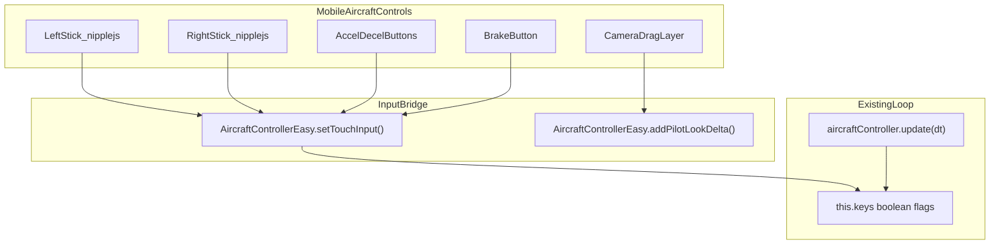
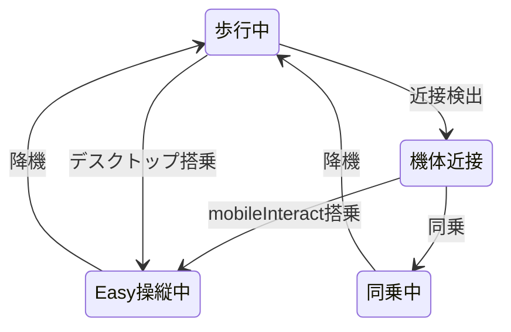

# モバイル Easy 飛行機操縦 UI 実装計画書

## 1. 目的

スマートフォン等のモバイル端末で **Easy 操縦モード** の飛行機を操作できるようにする。歩行用の `#mobile-controls` とは別に、操縦専用 UI を用意し、搭乗〜操縦〜降機まで一連のフローをモバイルで完結させる。

**スコープ外（本計画では扱わない）**

- Hard 操縦モードのモバイル UI（スロットル・フラップ等の入力が多く別設計が必要）
- WebXR / Quest 向けコントローラ入力
- 物理パラメータや Easy 飛行モデル自体の変更

---

## 2. 現状整理

### 2.1 Easy 操縦の入力（キーボードのみ）

[`addons/aircraft/client/aircraft-controller-easy.js`](addons/aircraft/client/aircraft-controller-easy.js) の `this.keys` を毎フレーム参照:

| キー | `keys` フィールド | 役割 |
|------|-------------------|------|
| W / S | `forward` / `back` | 推力 |
| A / D | `yawL` / `yawR` | ヨー |
| ↑ / ↓ | `pitchUp` / `pitchDn` | ピッチ |
| ← / → | `rollL` / `rollR` | ロール |
| Space | `brake` | 地上ブレーキ |

### 2.2 モバイルの制約（事実）

- [`addons/aircraft/client/aircraft-manager.js`](addons/aircraft/client/aircraft-manager.js) の `canBoard()` が `isMobileMode` 時に `false` を返すため、**現状モバイルでは搭乗不可**
- [`public/js/mobile-joystick-manager.js`](public/js/mobile-joystick-manager.js) は歩行専用（左スティック + カメラドラッグ + ジャンプ）
- Easy HUD（[`public/js/ui-manager.js`](public/js/ui-manager.js)）はモバイルで画面**下部中央**に配置（[`public/css/style.css`](public/css/style.css) L749–754）→ スティックと干渉しうる
- パイロット視線は `pointerLock` + `mousemove` 依存（[`aircraft-controller-easy.js`](addons/aircraft/client/aircraft-controller-easy.js) `_bindPilotMouseLook`）→ モバイルではタッチドラッグが必要

### 2.3 既存で流用できる資産

- `nipplejs`（[`package.json`](package.json)）— 歩行スティックと同じライブラリ
- `mobile-interact-btn` + `showMobileInteractButton`（[`public/js/ui-manager.js`](public/js/ui-manager.js)）— GLB インタラクトと同パターンで搭乗ボタン化
- `mobile-camera-drag-layer` のタッチドラッグ実装 — 視線操作の参考実装
- `isMobile()` / `MobileJoystickManager.init/destroy` のライフサイクル（[`public/js/main.js`](public/js/main.js)）

---

## 3. UI 設計（合意済み）

横画面推奨（既存 `mobile-landscape-overlay` を維持）。操縦中は歩行 UI を非表示にし、`#mobile-aircraft-controls` を表示する。

```
┌────────────────────────────────────────────────────────────┐
│ [降機] [視点]          HUD（速度・地上/空中・視点名）         │
│                                                            │
│           中央: タッチドラッグでコックピット視線             │
│                                                            │
│  ┌左スティック┐                        ┌右スティック┐      │
│  │ Y: 推力    │                        │ Y: ピッチ  │      │
│  │ X: ヨー    │                        │ X: ロール  │      │
│  └───────────┘                        └───────────┘      │
│  [減速] [加速]                              [ブレーキ]      │
└────────────────────────────────────────────────────────────┘
```

### 3.1 入力マッピング

| UI 要素 | Easy `keys` | しきい値・挙動 |
|---------|-------------|----------------|
| 右スティック Y（上） | `pitchUp` | `vector.y > 0.35` |
| 右スティック Y（下） | `pitchDn` | `vector.y < -0.35` |
| 右スティック X（左） | `rollL` | `vector.x < -0.35` |
| 右スティック X（右） | `rollR` | `vector.x > 0.35` |
| 左スティック Y（上） | `forward` | `vector.y > 0.35`（アナログ可: force で推力感） |
| 左スティック Y（下） | `back` | `vector.y < -0.35` |
| 左スティック X（左） | `yawL` | `vector.x < -0.35` |
| 左スティック X（右） | `yawR` | `vector.x > 0.35` |
| 加速ボタン（ホールド） | `forward` | スティックと OR |
| 減速ボタン（ホールド） | `back` | スティックと OR |
| ブレーキボタン（ホールド） | `brake` | ジャンプボタン位置付近 |
| 中央ドラッグ | `pilotLookYaw/Pitch` | 既存マウス感度と同等 |

**カジュアル補助**: 加速ボタンはデフォルトで大きめ（離陸〜巡航は「加速ホールド + 右スティック」で操作可能にする）。

### 3.2 HUD レイアウト調整（モバイル Easy 操縦時）

- HUD を**画面上部**へ移動（計器はコンパクト表示を維持）
- または操縦中のみ `aircraft-hud-easy-grid` を折りたたみ可能にする
- ミニマップ（右下 210px）は左スティックと重ならないよう、操縦中は左上 or 縮小を検討

---

## 4. アーキテクチャ



### 4.1 状態遷移



| 状態 | `#mobile-controls` | `#mobile-aircraft-controls` | 搭乗ボタン |
|------|--------------------|-----------------------------|-----------|
| 歩行 | 表示 | 非表示 | — |
| 機体近接 | 表示 | 非表示 | 表示（操縦/同乗） |
| Easy 操縦 | **非表示** | **表示** | 非表示 |
| 同乗 | 非表示 | 非表示（視線ドラッグのみ） | 非表示 |

---

## 5. 変更ファイル一覧

### 5.1 新規

| ファイル | 内容 |
|----------|------|
| [`public/js/mobile-aircraft-controls.js`](public/js/mobile-aircraft-controls.js) | nipplejs デュアルスティック、推力/ブレーキボタン、視線ドラッグ、`init`/`destroy`/`setPiloting` |
| [`docs/mobile-aircraft-easy-controls-plan.md`](docs/mobile-aircraft-easy-controls-plan.md) | 本計画書（この文書） |

### 5.2 HTML / CSS

| ファイル | 変更 |
|----------|------|
| [`public/index.html`](public/index.html) | `#mobile-aircraft-controls` コンテナ（左右スティックゾーン、推力/ブレーキボタン、操縦用ドラッグレイヤー）を `#mobile-controls` の直後に追加 |
| [`public/css/style.css`](public/css/style.css) | 操縦 UI のレイアウト（横画面 safe-area、z-index 900 台、HUD との非干渉）、`body.aircraft-piloting-mobile` 時の HUD 位置 |

### 5.3 操縦ロジック

| ファイル | 変更 |
|----------|------|
| [`addons/aircraft/client/aircraft-controller-easy.js`](addons/aircraft/client/aircraft-controller-easy.js) | `setTouchInput(partialKeys)` — タッチ入力で `this.keys` を上書き（キーボードと OR ではなく、タッチ有効時はタッチ優先 or マージ方針を明記）、`addPilotLookDelta(dx,dy)` — pointer lock なしでも視線更新 |
| [`addons/aircraft/client/aircraft-controller.js`](addons/aircraft/client/aircraft-controller.js) | ファサードに `setTouchInput` / `addPilotLookDelta` を委譲（Easy のみ no-op 以外） |

### 5.4 マネージャ・結線

| ファイル | 変更 |
|----------|------|
| [`addons/aircraft/client/aircraft-manager.js`](addons/aircraft/client/aircraft-manager.js) | `canBoard()` から `!isMobileMode` を削除（または Easy スロットのみモバイル搭乗可に限定）、`updateProximity` の `isMobileMode` 早期 return を削除、搭乗/降機時に `MobileAircraftControls` の表示切替コールバック |
| [`addons/aircraft/client/init.js`](addons/aircraft/client/init.js) | `setOnPilotingChange` でモバイル操縦 UI の init/destroy を結線 |
| [`public/js/main.js`](public/js/main.js) | 近接プロンプト分岐: モバイル + `nearestSlot` 時に `showMobileInteractButton` + `setMobileInteractAction` で `tryBoardNearest`、操縦中は歩行ジョイスティックを `destroy`、降機後に `init` 復帰 |

### 5.5 i18n

| ファイル | 追加キー例 |
|----------|-----------|
| [`public/js/metaverse-i18n.js`](public/js/metaverse-i18n.js) | `mobile.aircraftAccel`, `mobile.aircraftDecel`, `mobile.aircraftBrake`, `mobile.aircraftBoard` |

### 5.6 ドキュメント

| ファイル | 変更 |
|----------|------|
| [`addons/aircraft/README.md`](addons/aircraft/README.md) | モバイル Easy 操縦 UI・搭乗方法を追記、手動回帰観点を更新 |

---

## 6. 実装ステップ（推奨順）

### Phase 1: 入力ブリッジ（バックエンド寄り・UI なしでも単体確認可）

1. `AircraftControllerEasy.setTouchInput({ forward?, back?, ... })` を実装
   - `bindSlot` 時に `keys` をリセット
   - `unbind` / タッチ `end` 時に該当軸を false に戻す
2. `addPilotLookDelta(dx, dy)` を実装し、`_bindPilotMouseLook` と同じクランプを適用
   - `pointerLockElement` が無くても `addPilotLookDelta` は有効（モバイル専用パス）
3. `AircraftController` ファサードへ委譲メソッド追加

### Phase 2: モバイル操縦 UI

1. `public/index.html` に `#mobile-aircraft-controls` DOM を追加（初期 `aria-hidden="true"`）
2. `mobile-aircraft-controls.js` 実装
   - [`mobile-joystick-manager.js`](public/js/mobile-joystick-manager.js) をテンプレートに、左右 nipplejs 2 インスタンス
   - デッドゾーン 0.35、スティック size 120〜140px
   - 推力/減速/ブレーキは `touchstart`/`touchend` + `preventDefault`
3. `style.css` で横画面レイアウト（左右下コーナー、中央ドラッグは `pointer-events: none` 親 + 子 auto）

### Phase 3: ライフサイクル結線

1. `aircraft-manager.setOnPilotingChange` で:
   - Easy 操縦開始 → `MobileAircraftControls.init(aircraftController)` + `MobileJoystickManager.destroy()`
   - 降機 → `MobileAircraftControls.destroy()` + 歩行中なら `MobileJoystickManager.init()` 復帰
2. Hard 操縦時はモバイル UI を出さず、従来どおりキーボード前提（または搭乗自体をブロックする方針を README に明記）

### Phase 4: 搭乗フロー（モバイル）

1. `canBoard()` / `updateProximity()` からモバイルブロックを解除
2. [`main.js`](public/js/main.js) のプロンプト分岐（L1146 付近）を拡張:

```javascript
} else if (this.aircraftManager?.nearestSlot) {
    this.uiManager.hideTeleportPrompt();
    if (this.isMobileMode) {
        this.uiManager.showMobileInteractButton(
            this.aircraftManager.nearestSlot.label
        );
        this.uiManager.setMobileInteractAction(() => {
            void this.aircraftManager.tryBoardNearest();
        });
    } else {
        this.uiManager.showAircraftBoardPrompt(...);
    }
}
```

3. 他インタラクトと競合しないよう、ボタン非表示時は `setMobileInteractAction(null)`

### Phase 5: HUD / ミニマップ調整

1. Easy 操縦 + モバイル時、HUD を上部へ（`body.aircraft-piloting-mobile` クラスを `setMenuBarAircraftPiloting` 近辺で付与）
2. ミニマップ位置の干渉確認（左スティックと重なる場合は `top: 72px` 等へ）

### Phase 6: テスト・ドキュメント

1. 手動回帰（下記チェックリスト）
2. README / 本計画書の最終更新

---

## 7. テストチェックリスト

### 搭乗・降機

- [ ] モバイル横画面で機体近接時にインタラクトボタンが表示される
- [ ] タップで Easy 機体に搭乗できる（Hard 機体の扱いが仕様どおり）
- [ ] 二重搭乗・切断・ワールド変更時に正常降機（既存回帰）
- [ ] 降機後、歩行用ジョイスティックが復帰する

### 操縦

- [ ] 右スティックでピッチ・ロールが効く
- [ ] 左スティックで推力・ヨーが効く
- [ ] 加速/減速/ブレーキボタンが効く
- [ ] スティックとボタンの同時入力で意図しない挙動がない
- [ ] 中央ドラッグでコックピット視線が動く（pointer lock 不要）
- [ ] 地上ブレーキが接地時のみ効く

### UI 切り替え

- [ ] 操縦中は歩行ジョイスティック・ジャンプが非表示
- [ ] HUD とスティックが重ならない
- [ ] 縦画面オーバーレイが表示される
- [ ] チャット入力・モーダル表示中は操縦入力がブロックされる（既存 `_isInputActive` と同等）

### デスクトップ回帰

- [ ] デスクトップのキーボード操縦に影響なし
- [ ] デスクトップ搭乗プロンプト（E / クリック）に影響なし

---

## 8. リスクと対策

| リスク | 対策 |
|--------|------|
| タッチとキーボードの二重入力 | モバイルでは `setTouchInput` のみ使用。外付けキーボード利用は将来対応 |
| HUD とスティックの重なり | Phase 5 で HUD 上部移動。計器は既存 Easy コンパクト表示を維持 |
| Hard 機体への誤搭乗 | `controlMode !== 'easy'` の場合はモバイル搭乗を拒否しトースト表示、または README で「Hard は PC 推奨」と明記 |
| パフォーマンス（nipplejs x2） | 操縦中のみ生成、`destroy` で確実に解放（歩行と同パターン） |

---

## 9. 将来拡張（本計画の後続）

- Hard モード: スロットルスライダー + フラップ段ボタン + 簡略ヨー/ピッチ
- 操縦感度・デッドゾーンのユーザー設定（localStorage）
- 同乗時モバイル視線ドラッグ（`bindPassengerView` 向け `addPassengerLookDelta`）
