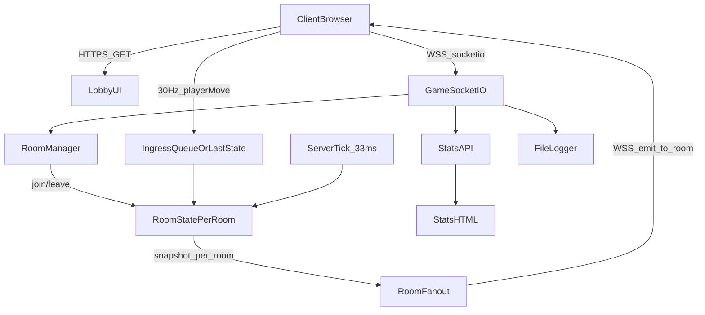

# 本番メタバースサーバー実装計画（段階的）

## 前提として確定した要件（事実）

- **同時接続**: 1000人/ルーム、ルーム最大10
- **ルーム**: ロビーUIから選択、途中でルーム移動可、ルームごとに別モデル（別マップ）
- **同期**: クライアントが移動計算、クライアント→サーバー送信はmax30Hz、サーバーは**tickでまとめて配信（max30Hz）**
- **データ**: position + Euler + quaternion、古い timestamp は破棄
- **認証**: 通常はユーザー名入力のみ、UUIDはセッションごとに新規、同名許可。adminは別ログイン
- **監視/ログ**: ルーム別人数、イベント/秒、送受信バイト/秒、遅延推定、切断理由。ログはファイル保存
- **本番**: ドメイン `mmh-virtual.jp`、Let’s Encrypt自動更新、将来VCは同一サーバー（UDP 50000-60000）
- **今回の確定事項（あなたの回答）**: **単一Nodeプロセス**、**距離でHzを落とすのは当面やらない（同一ルーム一律max30Hz）**

## 現状コードの把握（参照元）

- `nodeserver_/server.js` は Socket.io で `playerMove` を受けたら即 `broadcast` する構造、監視ページ(`/stats.html`)と追放(`/kick`)が存在
- `metaverse-simple/server.js` は 33msごとに `io.emit('players-update', playersArray)` で全員配信する構造

## 目標アーキテクチャ（単一プロセス・複数ルーム）

- **RoomStatePerRoom**: `roomId -> {players, sockets, mapId, tickConfig}`
- **Ingress**: 各プレイヤーの「最新入力（position/rot/timestamp）」のみ保持（古いtimestamp破棄）
- **Tick**: 33msごとにルームごとにスナップショット生成→そのルームの全員へ配信

## フェーズ0: ベースライン整理（壊さずに拡張できる土台）

- 対象: `nodeserver_/server.js` をベースにする
- 目的: ルーム/同期/監視/ログを追加しやすいように最小限モジュール分割
- 作業
  - サーバー設定・Socket.ioイベント・監視API・ログ機構を関数単位に整理
  - 既存イベント名（`userConnected`, `playerMove`, `chatMessage`, `sendEmoji` 等）は一旦維持し、後で互換を整理

## フェーズ1: ロビーUI + ルーム入退室の確立

- 対象ファイル
  - サーバー: [nodeserver_/server.js](nodeserver_/server.js)
  - クライアント: [nodeserver_/public/login.html](nodeserver_/public/login.html), [nodeserver_/public/login.html](nodeserver_/public/login.html)（新規にロビー画面を追加予定）
- 仕様
  - ロビーで `roomId` と表示名を選び、ゲーム画面へ遷移
  - Socket.ioで `joinRoom(roomId)` / `leaveRoom()` を実装
  - ルーム移動: 旧ルーム離脱→新ルーム入室（同一セッションUUIDは維持、サーバー側のプレイヤー状態はルームに紐づけて作り直し）
- サーバー側の要点
  - `socket.join(roomId)` を使用し、配信先をルームに限定
  - ルーム別に `players` を保持し、入室時に `currentUsers`（そのルームの）を返す

## フェーズ2: 30Hzサーバーtick集約配信（本体）

- 対象
  - サーバー: [nodeserver_/server.js](nodeserver_/server.js)
  - クライアント: [nodeserver_/public/js/client.js](nodeserver_/public/js/client.js)
- 仕様
  - クライアント→サーバー: `playerMove` を **max30Hz**（現状15Hzなので引き上げ）
  - サーバーは受信時にルーム内プレイヤーの **latest state** を更新（timestampが古ければ破棄）
  - サーバー→クライアント: 33msごとにルーム単位で `playersSnapshot`（全プレイヤー配列）を配信
- 注意（今回の確定）
  - 「距離でHzを落とす」はフェーズ外。まず同一ルーム一律で運用できる形を作る

## フェーズ3: 監視ページ拡張（ルーム対応 + 送受信量 + 遅延推定 + 切断理由）

- 対象
  - サーバー: [nodeserver_/server.js](nodeserver_/server.js)
  - 監視UI: [nodeserver_/public/stats.html](nodeserver_/public/stats.html), [nodeserver_/public/stats_login.html](nodeserver_/public/stats_login.html)
- 追加する指標（要件どおり）
  - ルーム別人数
  - イベント数/秒（既存のカウンターをルーム/イベント種別で拡張）
  - 送受信バイト/秒（Socket.io送信payloadサイズを概算計測して集計）
  - 遅延推定（クライアント送信timestampとサーバー受信時刻差の統計）
  - 切断理由（`disconnect` のreasonを記録）

## フェーズ4: ファイルログ（24h運用のため）

- 対象
  - サーバー: [nodeserver_/server.js](nodeserver_/server.js)
- 方針
  - ログはメモリ保持（最新N件）も残しつつ、同時にファイルへ追記
  - ログローテーション（日次 or サイズ基準）を導入
  - 監視ページからは「最新ログ」だけ参照（全ログ閲覧は別途）

## フェーズ5: 本番HTTPS/WSS + Let’s Encrypt自動更新

- 対象
  - サーバー/運用手順: [nodeserver_/HTTPS-SETUP.md](nodeserver_/HTTPS-SETUP.md), [nodeserver_/server.js](nodeserver_/server.js)
- 方針
  - `mmh-virtual.jp` の証明書を自動取得/更新
  - 本番はHTTPS/WSS必須、開発はHTTPでも起動可能（環境変数で切替）

## フェーズ6: 事前ハードニング（DDoS/荒らし対策の土台）

- まだ詳細未確定のため「土台」まで
  - 接続/イベントのレート制限（IP・socket単位）
  - ルーム入室回数制限、チャット長制限の厳密化
  - adminの別ログインの導線（既存の`/stats_login`とは分離）

## 将来フェーズ（今回は実装しない）

- mediasoup（VC/ビデオ）導入
  - UDP 50000-60000を使用
  - ルームとVCルームの紐付け

## 受け入れ基準（各フェーズの完了条件）

- フェーズ1: ロビーでルーム選択→入室、ルーム移動で旧ルームに残骸が残らない
- フェーズ2: 30Hz送信/33ms配信で、ルーム内で他プレイヤーが同期表示される
- フェーズ3: 監視ページにルーム別人数/イベント/秒/送受信量/遅延/切断理由が出る
- フェーズ4: ログがファイルに出力され、24h運用でメモリ肥大しない
- フェーズ5: 本番でHTTPS/WSSで接続できる